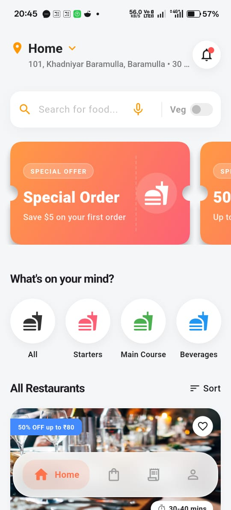
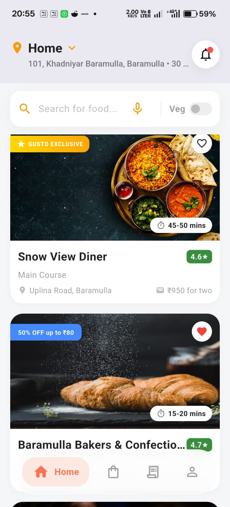
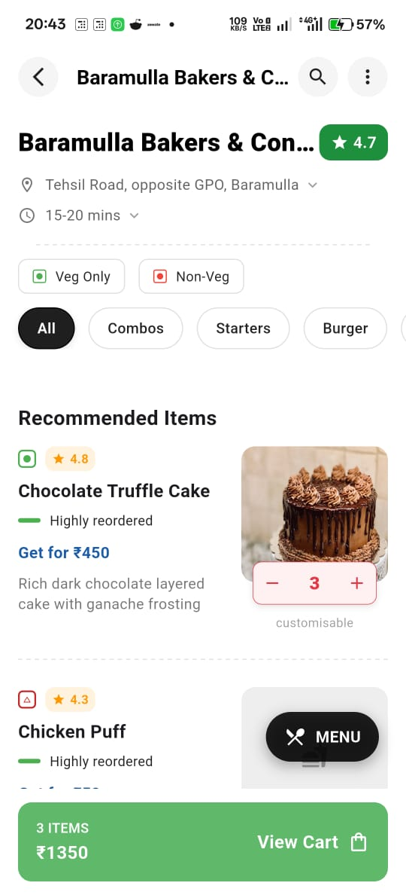
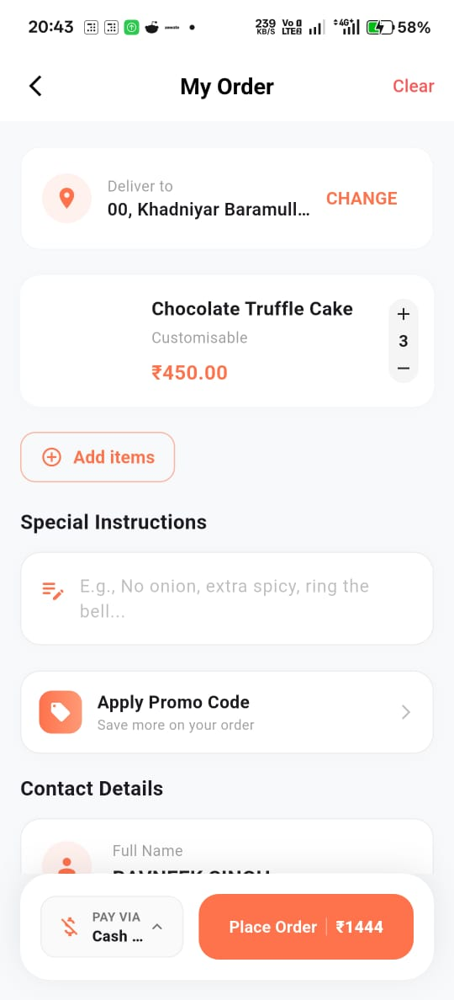

# Gusto - Food Delivery Application 🍔🏍️

**Gusto** is a premium, feature-rich food delivery application built with **Flutter**, designed to bridge the gap between hungry customers and their favorite local restaurants. 

Whether you're craving a quick snack or planning a feast, Gusto provides a beautifully crafted, intuitive, and seamless user experience from end to end. Discover new culinary delights with powerful search functionality, browse through rich restaurant menus with item customization, and manage your cart with ease. Once your order is placed, Gusto keeps you updated every step of the way with integrated Google Maps geolocation and instant push notifications. 

Backed by a robust **Supabase** infrastructure, Gusto ensures secure authentication, lightning-fast data retrieval, and reliable payment flows, making food delivery not just convenient, but truly delightful.

---

<div align="center">

| Home - Restaurants | Home - Categories | Restaurant Menu | Cart & Checkout |
|:---:|:---:|:---:|:---:|
|  |  |  |  |
| *Nearby Restaurants List* | *Special Offers & Categories* | *Menu & Customization* | *Order Review & Instructions* |

</div>

---

## ✨ Key Features

- **Authentication:** Secure user login, registration, and OTP verification using Supabase.
- **Home Dashboard:** Explore nearby restaurants with "Gusto Exclusive" badges, special offer banners, and food categories (Starters, Main Course, etc.).
- **Smart Filtering:** Instant Veg/Non-Veg toggle and smart search for quick discovery.
- **Detailed Restaurant Info:** Displays ratings, delivery times, and cost-for-two at a glance.
- **Advanced Menu:** Categorized food items with "Highly Reordered" labels, beautiful item imagery, and customization options.
- **Seamless Cart:** Integrated "View Cart" bar with real-time price updates and quantity management.
- **Order Review:** Add special instructions, apply promo codes, and verify contact details before placing an order.
- **Geolocation & Mapping:** Integrated with Google Maps for precise address selection (e.g., Khadniyar, Baramulla).
- **User Profile:** Manage personal details, saved addresses, language preferences, and order history.
- **Notifications:** Real-time push notification system for order updates.

---

## 🛠️ Technology Stack & Dependencies

Gusto is built with modern Flutter development practices. Key packages include:

* **State Management:** `provider`
* **Backend & Auth:** `supabase_flutter`
* **Mapping & Location:** `google_maps_flutter`, `geolocator`, `geocoding`
* **Network & API:** `http`, `cached_network_image`
* **UI & Animations:** `lottie`, `carousel_slider`, `smooth_page_indicator`, `google_fonts`, `cupertino_icons`
* **Utilities:** `shared_preferences`, `permission_handler`, `intl`, `speech_to_text`, `image_picker`

---

## 📁 Project Structure

The project follows a **Feature-First / Clean Architecture** pattern, ensuring scalability and maintainability.

```text
lib/
├── core/
│   └── widgets/          # Shared widgets (e.g., bottom_button.dart, custom inputs)
├── features/
│   ├── auth/             # Login, OTP verification, Registration
│   ├── cart/             # Cart management, Checkout, Order Timer
│   ├── home/             # Main dashboard, Restaurant cards
│   ├── notifications/    # Notification alerts and history
│   ├── payment/          # Payment methods and gateways
│   ├── profile/          # User settings, Language screen, Address management
│   ├── restaurant/       # Restaurant menus and details
│   ├── search/           # Search functionality and voice search
│   └── splash/           # Initial app loading screen
└── main.dart             # App entry point
```

---

## 🚀 Getting Started

Follow these steps to run the application on your local machine.

### Prerequisites

- [Flutter SDK](https://docs.flutter.dev/get-started/install) (Version ^3.9.0)
- Dart SDK
- Android Studio / Xcode for emulators
- A Supabase Project (for backend functionalities)
- Google Maps API Key (for Android/iOS)

### Installation

1. **Clone the repository:**
   ```bash
   git clone https://github.com/bavneeksingh/Gusto-Food-Delivery-App.git
   cd gusto
   ```

2. **Install dependencies:**
   ```bash
   flutter pub get
   ```

3. **Configure Environment Variables:**
   * Create a `.env` file in the root directory.
   * Copy the contents of `.env.example` into `.env` and add your real credentials:
     ```text
     SUPABASE_URL=your_supabase_url
     SUPABASE_ANON_KEY=your_supabase_anon_key
     GOOGLE_MAPS_API_KEY=your_google_maps_api_key
     ```
   * Ensure your Google Maps API keys are also added to the respective `AndroidManifest.xml` (Android) and `AppDelegate.swift` (iOS).

4. **Run the App:**
   ```bash
   flutter run
   ```

---

## 🤝 Contributing

Contributions are what make the open-source community such an amazing place to learn, inspire, and create. Any contributions you make are **greatly appreciated**.

1. Fork the Project
2. Create your Feature Branch (`git checkout -b feature/AmazingFeature`)
3. Commit your Changes (`git commit -m 'Add some AmazingFeature'`)
4. Push to the Branch (`git push origin feature/AmazingFeature`)
5. Open a Pull Request

---

## 👨‍💻 Author

**Bavneek Singh**
- GitHub: [@bavneeksingh](https://github.com/bavneeksingh)
